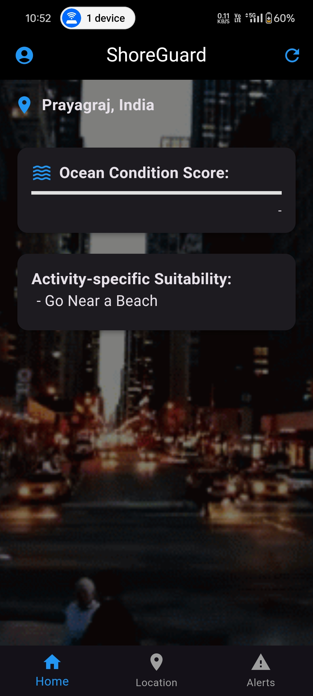
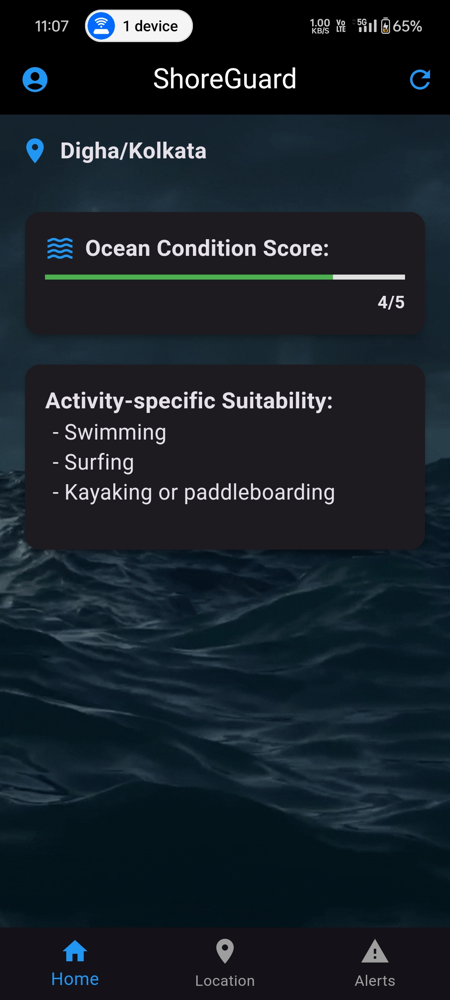
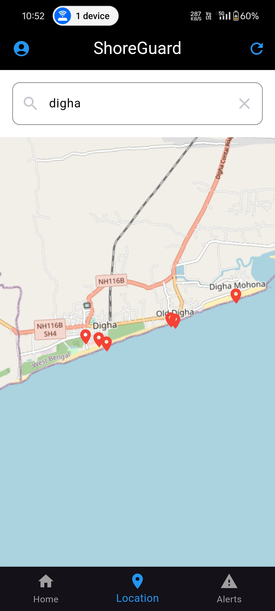
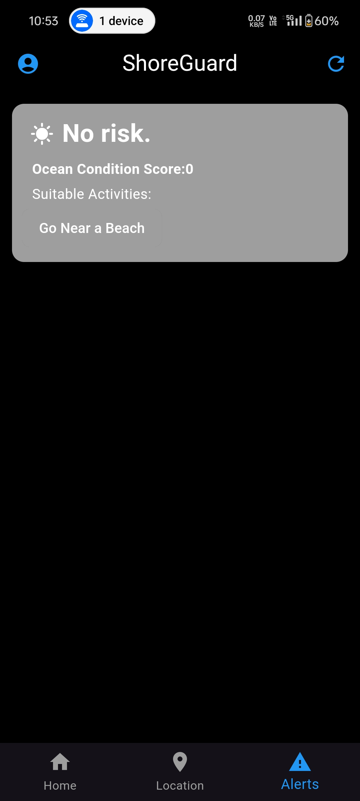

<h1 align="center" style="border-bottom: none">
    <b>
     Mobile application to provide recreational suitability information of beach locations across the world.       </b>
<br>
</h1>


## Installation

Clone the repo then inside ShoreGuard folder use

```bash
flutter run
```

# App Screenshots

Here are some screenshots of our app to showcase its features and interface.

| Home Screen | Home Screen Under Action | Search Screen | Alerts Screen |
|-------------|-------------|----------------|-----------------|
|  |  |  |  |


## Contributing

Pull requests are welcome. For major changes, please open an issue first
to discuss what you would like to change.

Please make sure to update tests as appropriate.

## License

[GPL](https://www.gnu.org/licenses/gpl-3.0.en.html)